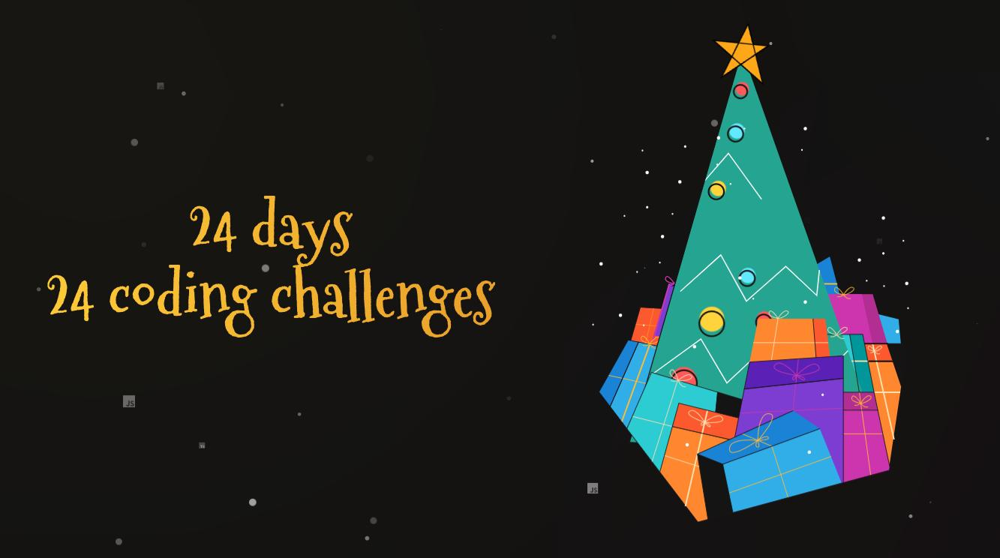

## Here are my solutions to https://adventjs.dev/

2021

| #   | Challenge                                    | Source                                                  |
| --- | -------------------------------------------- | ------------------------------------------------------- |
| 1   | __  | **[_Solution_](./src/2021/Challenge%20%231/index.js)**  |
| 2   | __  | **[_Solution_](./src/2021/Challenge%20%232/index.js)**  |
| 3   | __  | **[_Solution_](./src/2021/Challenge%20%233/index.js)**  |
| 4   | __  | **[_Solution_](./src/2021/Challenge%20%234/index.js)**  |
| 5   | __  | **[_Solution_](./src/2021/Challenge%20%235/index.js)**  |
| 6   | __  | **[_Solution_](./src/2021/Challenge%20%236/index.js)**  |
| 7   | __  | **[_Solution_](./src/2021/Challenge%20%237/index.js)**  |
| 8   | __  | **[_Solution_](./src/2021/Challenge%20%238/index.js)**  |
| 9   | __  | **[_Solution_](./src/2021/Challenge%20%239/index.js)**  |
| 10  | __ | **[_Solution_](./src/2021/Challenge%20%2310/index.js)** |
| 11  | __ | **[_Solution_](./src/2021/Challenge%20%2311/index.js)** |
| 12  | __ | **[_Solution_](./src/2021/Challenge%20%2312/index.js)** |
| 13  | __ | **[_Solution_](./src/2021/Challenge%20%2313/index.js)** |
| 14  | __ | **[_Solution_](./src/2021/Challenge%20%2314/index.js)** |
| 15  | __ | **[_Solution_](./src/2021/Challenge%20%2315/index.js)** |
| 16  | __ | **[_Solution_](./src/2021/Challenge%20%2316/index.js)** |
| 17  | __ | **[_Solution_](./src/2021/Challenge%20%2317/index.js)** |
| 18  | __ | **[_Solution_](./src/2021/Challenge%20%2318/index.js)** |
| 19  | __ | **[_Solution_](./src/2021/Challenge%20%2319/index.js)** |
| 20  | __ | **[_Solution_](./src/2021/Challenge%20%2320/index.js)** |
| 21  | __ | **[_Solution_](./src/2021/Challenge%20%2321/index.js)** |
| 22  | __ | **[_Solution_](./src/2021/Challenge%20%2322/index.js)** |
| 23  | __ | **[_Solution_](./src/2021/Challenge%20%2323/index.js)** |
| 24  | __ | **[_Solution_](./src/2021/Challenge%20%2324/index.js)** |

2022

| #   | Challenge                                                                           | Source                                                  |
| --- | ----------------------------------------------------------------------------------- | ------------------------------------------------------- |
| 1   | _[Automating Christmas gift wrapping!](./src/2022/Challenge%20%231/readme.md)_      | **[_Solution_](./src/2022/Challenge%20%231/index.js)**  |
| 2   | _[Nobody wants to do extra hours at work](./src/2022/Challenge%20%232/readme.md)_   | **[_Solution_](./src/2022/Challenge%20%232/index.js)**  |
| 3   | _[How many packs of gifts can Santa carry?](./src/2022/Challenge%20%233/readme.md)_ | **[_Solution_](./src/2022/Challenge%20%233/index.js)**  |
| 4   | _[Box inside a box and another...](./src/2022/Challenge%20%234/readme.md)_          | **[_Solution_](./src/2022/Challenge%20%234/index.js)**  |
| 5   | _[Optimizing Santa's trips](./src/2022/Challenge%20%235/readme.md)_                 | **[_Solution_](./src/2022/Challenge%20%235/index.js)**  |
| 6   | _[Creating xmas decorations](./src/2022/Challenge%20%236/readme.md)_                | **[_Solution_](./src/2022/Challenge%20%236/index.js)**  |
| 7   | _[Doing gifts inventory](./src/2022/Challenge%20%237/readme.md)_                    | **[_Solution_](./src/2022/Challenge%20%237/index.js)**  |
| 8   | _[We need a mechanic!](./src/2022/Challenge%20%238/readme.md)_                      | **[_Solution_](./src/2022/Challenge%20%238/index.js)**  |
| 9   | _[Crazy Xmas lights](./src/2022/Challenge%20%239/readme.md)_                        | **[_Solution_](./src/2022/Challenge%20%239/index.js)**  |
| 10  | _[The Santa Claus sleigh jump](./src/2022/Challenge%20%2310/readme.md)_             | **[_Solution_](./src/2022/Challenge%20%2310/index.js)** |
| 11  | __                                        | **[_Solution_](./src/2022/Challenge%20%2311/index.js)** |
| 12  | __                                        | **[_Solution_](./src/2022/Challenge%20%2312/index.js)** |
| 13  | __                                        | **[_Solution_](./src/2022/Challenge%20%2313/index.js)** |
| 14  | __                                        | **[_Solution_](./src/2022/Challenge%20%2314/index.js)** |
| 15  | __                                        | **[_Solution_](./src/2022/Challenge%20%2315/index.js)** |
| 16  | __                                        | **[_Solution_](./src/2022/Challenge%20%2316/index.js)** |
| 17  | __                                        | **[_Solution_](./src/2022/Challenge%20%2317/index.js)** |
| 18  | __                                        | **[_Solution_](./src/2022/Challenge%20%2318/index.js)** |
| 19  | __                                        | **[_Solution_](./src/2022/Challenge%20%2319/index.js)** |
| 20  | __                                        | **[_Solution_](./src/2022/Challenge%20%2320/index.js)** |
| 21  | __                                        | **[_Solution_](./src/2022/Challenge%20%2321/index.js)** |
| 22  | __                                        | **[_Solution_](./src/2022/Challenge%20%2322/index.js)** |
| 23  | __                                        | **[_Solution_](./src/2022/Challenge%20%2323/index.js)** |
| 24  | __                                        | **[_Solution_](./src/2022/Challenge%20%2324/index.js)** |

2023

| #   | Challenge                                    | Source                                                  |
| --- | -------------------------------------------- | ------------------------------------------------------- |
| 1   | __  | **[_Solution_](./src/2023/Challenge%20%231/index.js)**  |
| 2   | __  | **[_Solution_](./src/2023/Challenge%20%232/index.js)**  |
| 3   | __  | **[_Solution_](./src/2023/Challenge%20%233/index.js)**  |
| 4   | __  | **[_Solution_](./src/2023/Challenge%20%234/index.js)**  |
| 5   | __  | **[_Solution_](./src/2023/Challenge%20%235/index.js)**  |
| 6   | __  | **[_Solution_](./src/2023/Challenge%20%236/index.js)**  |
| 7   | __  | **[_Solution_](./src/2023/Challenge%20%237/index.js)**  |
| 8   | __  | **[_Solution_](./src/2023/Challenge%20%238/index.js)**  |
| 9   | __  | **[_Solution_](./src/2023/Challenge%20%239/index.js)**  |
| 10  | __ | **[_Solution_](./src/2023/Challenge%20%2310/index.js)** |
| 11  | __ | **[_Solution_](./src/2023/Challenge%20%2311/index.js)** |
| 12  | __ | **[_Solution_](./src/2023/Challenge%20%2312/index.js)** |
| 13  | __ | **[_Solution_](./src/2023/Challenge%20%2313/index.js)** |
| 14  | __ | **[_Solution_](./src/2023/Challenge%20%2314/index.js)** |
| 15  | __ | **[_Solution_](./src/2023/Challenge%20%2315/index.js)** |
| 16  | __ | **[_Solution_](./src/2023/Challenge%20%2316/index.js)** |
| 17  | __ | **[_Solution_](./src/2023/Challenge%20%2317/index.js)** |
| 18  | __ | **[_Solution_](./src/2023/Challenge%20%2318/index.js)** |
| 19  | __ | **[_Solution_](./src/2023/Challenge%20%2319/index.js)** |
| 20  | __ | **[_Solution_](./src/2023/Challenge%20%2320/index.js)** |
| 21  | __ | **[_Solution_](./src/2023/Challenge%20%2321/index.js)** |
| 22  | __ | **[_Solution_](./src/2023/Challenge%20%2322/index.js)** |
| 23  | __ | **[_Solution_](./src/2023/Challenge%20%2323/index.js)** |
| 24  | __ | **[_Solution_](./src/2023/Challenge%20%2324/index.js)** |

